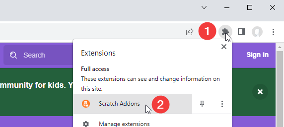
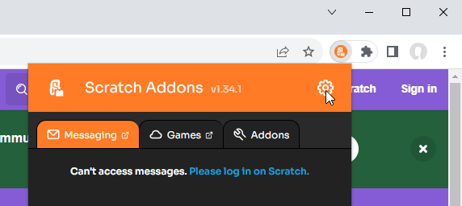
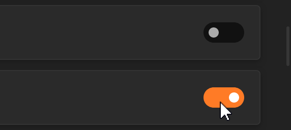

import SupportedBrowsers from "../supported-browsers";

## Installing

Let's get started by installing Scratch Addons.

<SupportedBrowsers />

More information can be read on [Installing](../installing).

## Getting started

To get started, you need to access the settings page of the addon to see the functions of it.

1. Locate Scratch Addons on the toolbar and click it.

   Usually, it is on the top-right corner of your browser.
For Google Chrome users, you may need to click the puzzle icon to find the extension icon.

   

2. Press the gear icon to go to the Settings page.

   

3. Feel free to look through the addons list and turn on/off whatever you want.

   You can also configure an addon in its settings that will open when enabled or expanded.

   
