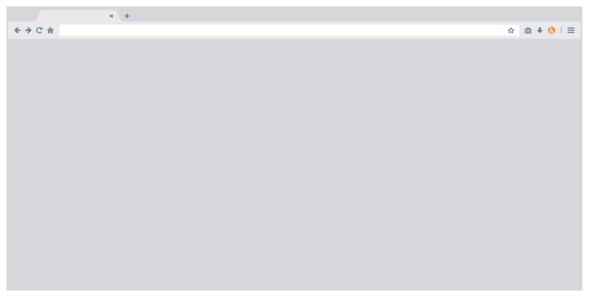
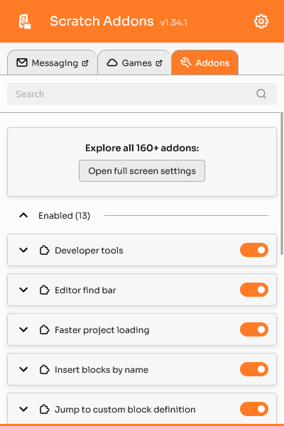
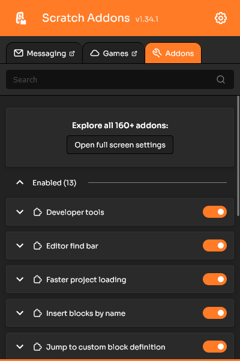
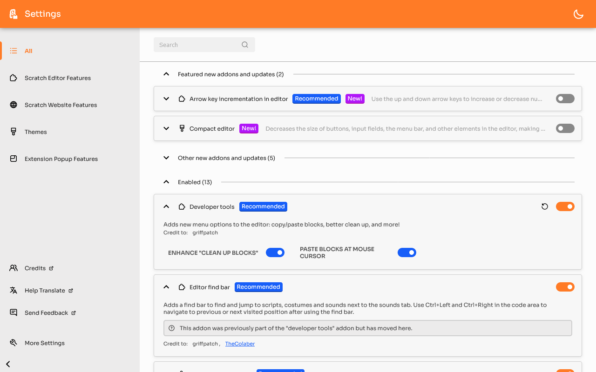
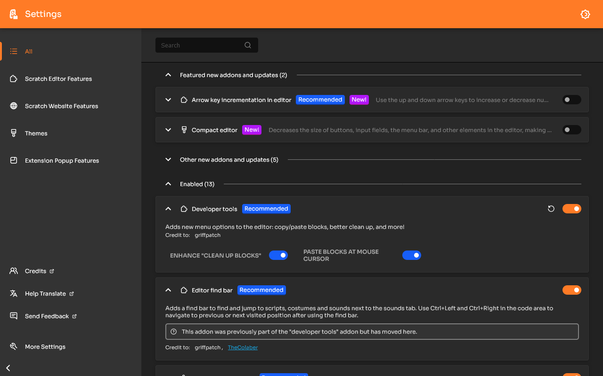
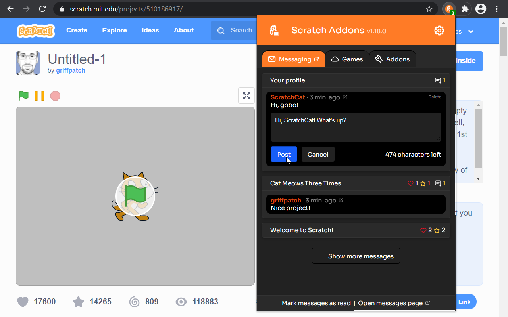
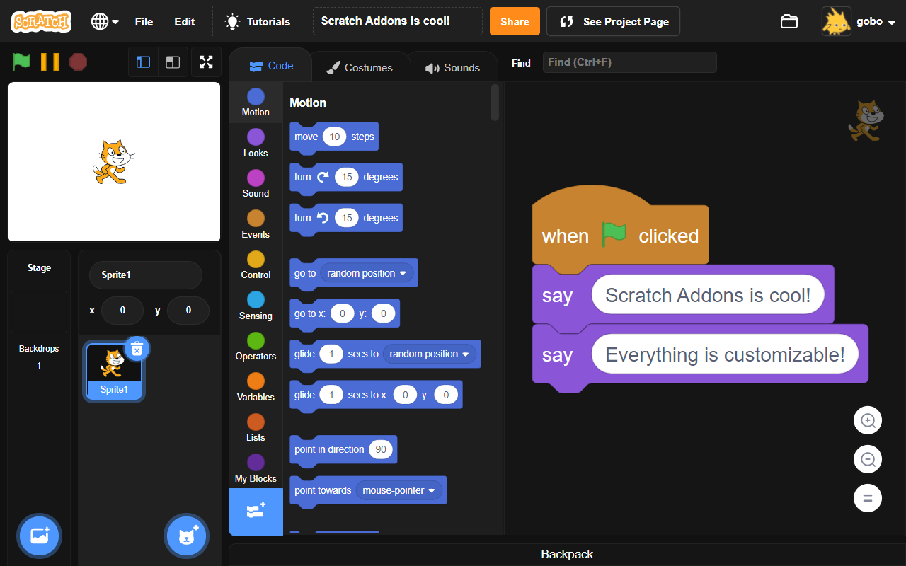
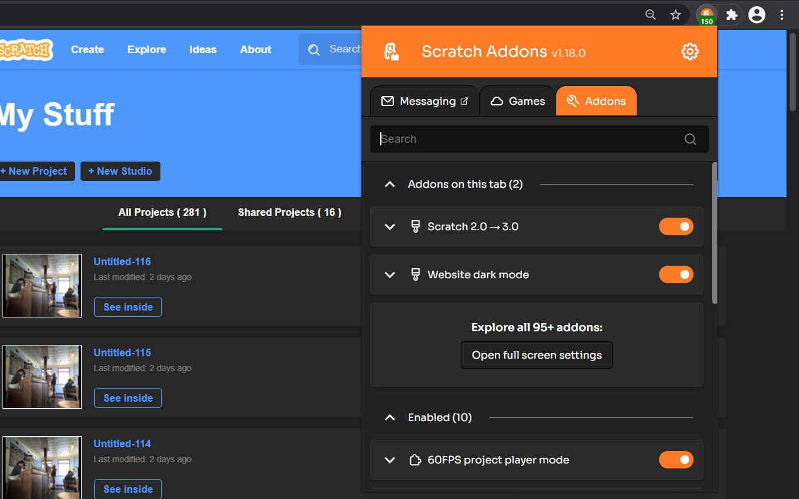
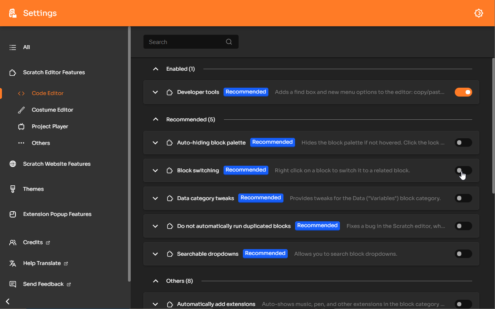

import "./index/style.scss";
import "./index/script";
import ApplicationMdApplication from "!!raw-loader!./index/application-ld-application.json";
import ApplicationMdOrganization from "!!raw-loader!./index/application-ld-organization.json";
import info from "@site/../common/info";
import InstallButton from "./index/InstallButton";
import AddonCard from "./index/AddonCard";
import "@splidejs/react-splide/css";
import { Splide, SplideSlide } from "@splidejs/react-splide";
import Divider1 from "./index/Divider1.svg";
import Divider2 from "./index/Divider2.svg";
import Odometer from "react-odometerjs";
// import "odometer/themes/odometer-theme-default.sass";

<section id="intro" class="px-4 pb-0 mb-0 intro-heading text-left">
	

		<h1 class="display-4 m-0 mb-3 p-0">
			All-in-one browser extension for Scratch
		</h1>
		

			Scratch Addons combines new and existing features and themes for the Scratch website and project editor into one easy-to-access and configurable browser extension.
		

		

			<a id="install-intro" class="btn btn-white btn-lg install-btn disabled">
				

					
						
					
					Install for Chrome
				

				
free, open source

			</a>
			<a href="#features" class="btn" id="read-more">or read more</a>
		

		
	

</section>

<Divider1 />

<section id="features" class="container text-center py-4">
	<h2>Features</h2>
	

		

			

				

					

						
					

				

				

					<h3>Addons</h3>
					
Scratch Addons consists of addons, which are features that can empower your Scratch website and editor experience.

				

			

			

				

					

						
					

				

				

					<h3>Customizable</h3>
					
Scratch Addons has an easy-to-use interface to control various settings of each feature and theme.

				

			

			

				

					

						
					

				

				

					<h3>International</h3>
					
Not just English. Scratch Addons is available in Spanish, Russian, Japanese, French, and many more.

				

			

			

				

					

						
					

				

				

					<h3>Open source</h3>
					
Scratch Addons is free, open source, and built by a community of Scratchers.

				

			

		

		

			<Splide
				hasTrack={true}
				options={{
					type: "loop",
					perMove: 1,
					start: 1,
					autoPlay: "pause",
					intersection: {
						inView: { autoPlay: true },
						outView: { autoPlay: false },
					},
					interval: 4000,
					pauseOnHover: true,
				}}>
				{/*{ partial "youtube" (dict "id" "nQ4N9zlzj0M") }*/}
				<SplideSlide>
					
				</SplideSlide>
				<SplideSlide>
					
				</SplideSlide>
				<SplideSlide>
					
				</SplideSlide>
				<SplideSlide>
					
				</SplideSlide>
				<SplideSlide>
					
				</SplideSlide>
				<SplideSlide>
					
				</SplideSlide>
				<SplideSlide>
					
				</SplideSlide>
				<SplideSlide>
					
				</SplideSlide>
			</Splide>
		

	

</section>

<Divider2 />

<section id="highlights" class="py-4">
	<h2 class="text-center">Highlights</h2>
	

		Remember, these are just the highlights.
		<a href="/addons" class="white-underline">There's more!</a>
	

	<Splide
		hasTrack={true}
		options={{
			type: "loop",
			perPage: 5,
			perMove: 1,
			gap: "0.5rem",
			breakpoints: {
				1399.98: { perPage: 4, },
				1199.98: { perPage: 3, },
				767.98: { perPage: 2, },
				575.98: { perPage: 1, },
			},
		}}>
		<SplideSlide>
			
		</SplideSlide>
		<SplideSlide>
			
		</SplideSlide>
	</Splide>

	

		

			<ul class="splide__list align-items-start">

			{/* {{- if ( index $.Site.Data.addons $.Page.Language.Lang ) }}
				{{- template "addon-card" ( index $.Site.Data.addons $.Page.Language.Lang ) -}}
			{{ else }}
				{{- template "addon-card" $.Site.Data.addons.en -}}
			{{ end -}} */}

			</ul>
		

		{/* <a class="carousel-control-prev" role="button" data-slide="prev">
			
			{{ T "IndexPage.Intro.Carousel.Previous" }}
		</a>
		<a class="carousel-control-next" role="button" data-slide="next">
			
			{{ T "IndexPage.Intro.Carousel.Next" }}
		</a> */}
	

</section>

<Divider1 />

<section id="install" class="container text-center py-4">
	

		

		

			<h2>Install</h2>
			
Ready to power up Scratch? Get it now!

			

				<InstallButton link={info.extension.store.chrome.link} icon="simple-icons:googlechrome" title="Chrome" />
				<InstallButton link={info.extension.store.firefox.link} icon="simple-icons:firefoxbrowser" title="Firefox" />
				<InstallButton link={info.extension.store.edge.link} icon="simple-icons:microsoftedge" title="Edge" />
			

			

				...or <a href="https://github.com/ScratchAddons/ScratchAddons/releases" target="_blank" rel="noopener">download it from GitHub</a>
				or <a href="/docs/getting-started/installing#from-source" target="_blank" rel="noopener">install it from the source</a>.
			

		

		

			

				<Odometer value={info.extension.users} format="d" />
			

			
Users

		

		

	

</section>

